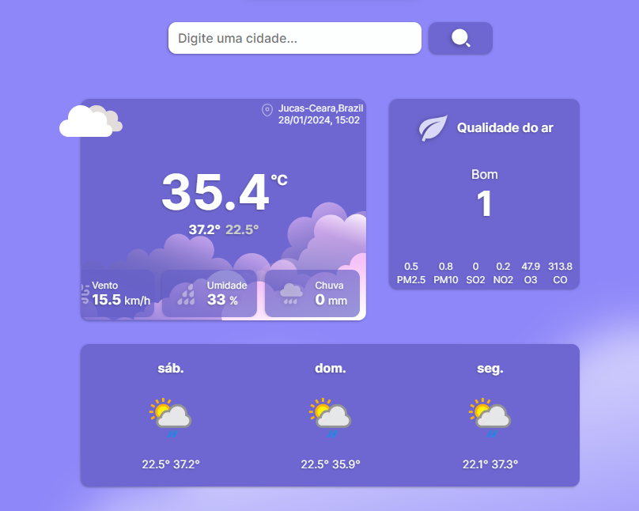

<h1 style="text-align:center;">Weather Forecast</h1>

<div style="text-align: justify;">
Este site foi desenvolvido com o objetivo de oferecer informações meteorológicas precisas e em tempo real, com base em dados fornecidos por uma API meteorológica confiável.

Explore as condições climáticas atuais e futuras de qualquer localidade de forma intuitiva e visualmente atraente. O "Weather Forecast" proporciona uma interface amigável que permite aos usuários acessar facilmente dados detalhados sobre temperatura, umidade, velocidade do vento e outros aspectos meteorológicos relevantes.

</div>



## Funcionalidades

- Totalmente responsivo.
- Página com informações meteorológicas.
- Campo de busca ao digitar nome da cidade.
- Navegação inteligente.

## Tecnologias Utilizadas

- `React`
- `Axios`
- `TypeScript`
- `React Hook Form`
- `React Router DOM`
- `Styled Components`
- `React Tanstack Query`

## Configuração do Projeto

```bash
# Clone o repositório
$ https://github.com/CiceroEduardo84/Weather_Forecast.git

# Instale as dependências
$ npm install

# Execute o projeto
$ npm run dev
```

## Variáveis Ambiente

```ini
VITE_API = "http://api.weatherapi.com/v1/forecast.json?"
VITE_API_SEARCH = "http://api.weatherapi.com/v1/search.json?"
VITE_KEY = "API KEY"
```

## Contribuição

Para contribuir com melhorias, correções de bugs ou novas funcionalidades, basta seguir estas etapas:

1. Faça um fork do projeto
2. Crie uma branch para sua contribuição:

```bash
$ git checkout -b nome-sobrenome
```

3. Faça as alterações desejadas
4. Envie um pull request

## Links

- [Deploy](https://weather-forecast-gamma-fawn.vercel.app/)
- [WeatherAPI](https://www.weatherapi.com/)
